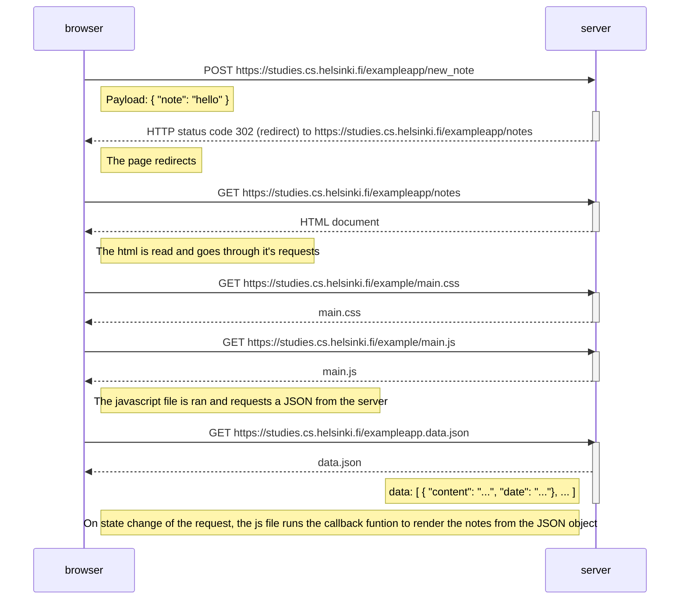

# New Note Diagram

```mermaid
sequenceDiagram
    participant browser
    participant server

    browser->>server: POST https://studies.cs.helsinki.fi/exampleapp/new_note
    Note right of browser: Payload: { "note": "hello" }
    activate server
    server-->>browser: HTTP status code 302 (redirect) to https://studies.cs.helsinki.fi/exampleapp/notes
    deactivate server
    Note right of browser: The page redirects

    browser->>server: GET https://studies.cs.helsinki.fi/exampleapp/notes
    activate server
    server-->>browser: HTML document
    deactivate server

    Note right of browser: The html is read and goes through it's requests

    browser->>server: GET https://studies.cs.helsinki.fi/example/main.css
    activate server
    server-->>browser: main.css
    deactivate server

    browser->>server: GET https://studies.cs.helsinki.fi/example/main.js
    activate server
    server-->>browser: main.js
    deactivate server

    Note right of browser: The javascript file is ran and requests a JSON from the server

    browser->>server: GET https://studies.cs.helsinki.fi/exampleapp.data.json
    activate server
    server-->>browser: data.json 

    note left of server: data: [ { "content": "...", "date": "..."}, ... ]
    deactivate server

    Note right of browser: On state change of the request, the js file runs the callback funtion to render the notes from the JSON object
```