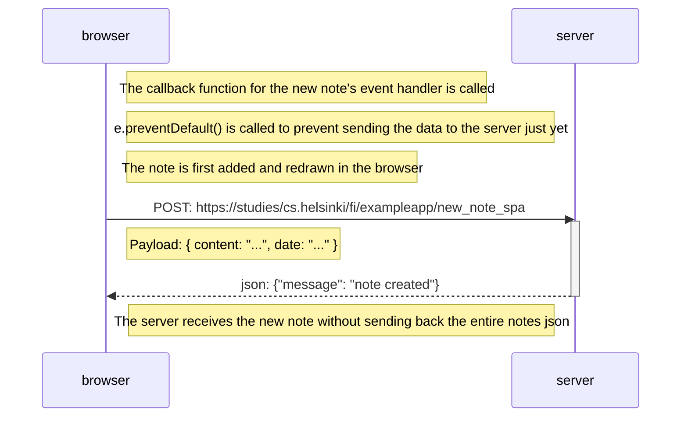

```mermaid
sequenceDiagram
    participant browser
    participant server
Note right of browser: The callback function for the new note's event handler is called
Note right of browser: e.preventDefault() is called to prevent sending the data to the server just yet
Note right of browser: The note is first added and redrawn in the browser

browser->>server: POST: https://studies/cs.helsinki/fi/exampleapp/new_note_spa
activate server
Note right of browser: Payload: { content: "...", date: "..." }
server-->>browser: json: {"message": "note created"}
deactivate server

Note left of server: The server receives the new note without sending back the entire notes json
```